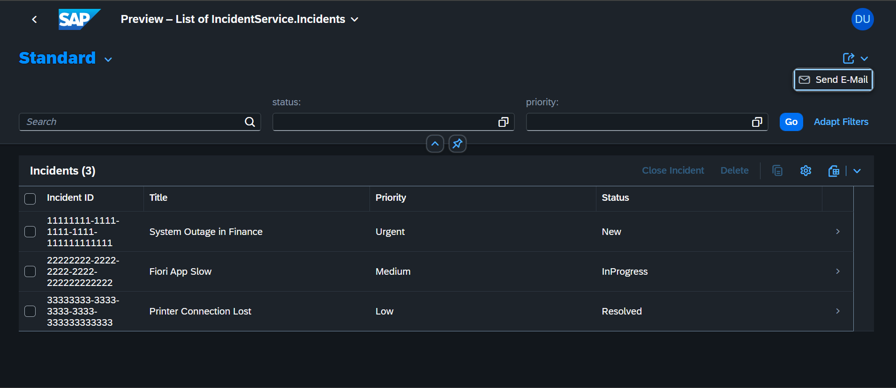
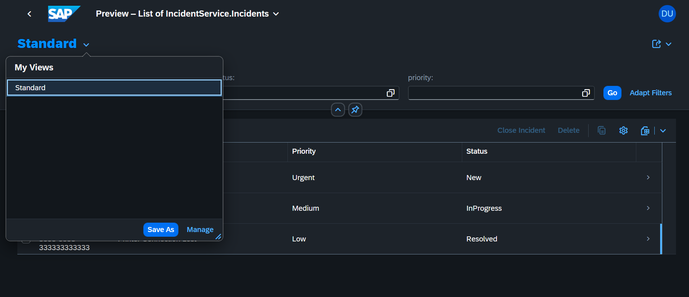

# 🛠️ SAP CAP Incident Management System

[](https://github.com/Banoth281/sap-incident-management/actions/workflows/ci.yml)

Enterprise-grade Incident Management System built using the **SAP Cloud Application Programming Model (CAP)**, **Node.js**, **OData v4**, **SQLite**, and **SAP Fiori Elements**.

This project demonstrates enterprise backend development using SAP technologies, including CDS data modeling, OData services, business logic implementation, and automated CI with GitHub Actions.

---

# 📖 Overview

The SAP CAP Incident Management System provides a complete backend service for managing incidents through SAP Fiori Elements.

The application demonstrates:

- Enterprise CDS data modelling
- OData v4 service development
- SAP Fiori Elements UI
- Custom business logic
- SQLite database integration
- GitHub Actions CI pipeline

---

# 🚀 Features

- ✅ Incident Management
- ✅ Customer Management
- ✅ Priority Management
- ✅ Status Tracking
- ✅ SAP Fiori Elements UI
- ✅ OData v4 APIs
- ✅ CDS Data Models
- ✅ SQLite Database
- ✅ GitHub Actions CI
- ✅ Automated Validation

---

# 🏗️ Architecture

```
                    +-------------------------+
                    |     SAP Fiori UI        |
                    +-----------+-------------+
                                |
                                |
                     OData v4 Services
                                |
                                |
                    +-----------v-------------+
                    |    SAP CAP Services     |
                    |   (Node.js + CDS)       |
                    +-----------+-------------+
                                |
                                |
                     Business Logic (JS)
                                |
                                |
                    +-----------v-------------+
                    |      SQLite Database    |
                    +-------------------------+
```

---

# 🧰 Technology Stack

| Technology | Purpose |
|------------|---------|
| SAP CAP | Backend Framework |
| Node.js | Runtime |
| SAP CDS | Data Modelling |
| OData v4 | RESTful Services |
| SQLite | Database |
| SAP Fiori Elements | UI |
| GitHub Actions | CI/CD |
| Express.js | Web Framework |

---

# 📁 Project Structure

```
sap-incident-management
│
├── db
│   ├── data
│   └── schema.cds
│
├── srv
│   ├── cat-service.cds
│   ├── cat-service-ui.cds
│   └── cat-service.js
│
├── images
│
├── .github
│   └── workflows
│
├── package.json
├── package-lock.json
├── mta.yaml
└── README.md
```

---

# ⚙️ Installation

Clone the repository

```bash
git clone https://github.com/Banoth281/sap-incident-management.git
```

Move into the project

```bash
cd sap-incident-management
```

Install dependencies

```bash
npm install
```

Start the CAP application

```bash
npx cds watch
```

---

# ▶️ Running the Application

Open your browser

```
http://localhost:4004
```

Useful endpoints

| Endpoint | Description |
|----------|-------------|
| `/` | CAP Home Page |
| `/odata/v4/incident` | OData Service |
| `/odata/v4/incident/$metadata` | Service Metadata |
| `/odata/v4/incident/Incidents` | Incident Records |

---

# 📷 Application Screenshots

## SAP Fiori List Report



---

## SAP Fiori Object Page



---

# ⚡ GitHub Actions

This project uses **GitHub Actions** for Continuous Integration.

The workflow automatically performs:

- Checkout Repository
- Setup Node.js
- Install Dependencies
- Verify SAP CAP Project
- Validate CDS Models
- Execute Tests

---

# 📊 Database

SQLite is used as the local development database.

CAP automatically creates and seeds the database during development.

---

# 📡 OData Services

Example endpoint

```
GET /odata/v4/incident/Incidents
```

Metadata

```
GET /odata/v4/incident/$metadata
```

---

# 🎯 Skills Demonstrated

- SAP CAP Development
- Node.js Backend Development
- SAP CDS Modelling
- OData v4 APIs
- SQLite Integration
- SAP Fiori Elements
- Enterprise Application Development
- GitHub Actions CI/CD
- RESTful Services
- Backend Validation

---

# 👨‍💻 Author

**Santhosh Banoth**

- GitHub: https://github.com/Banoth281
- LinkedIn: https://linkedin.com/in/banoth281

---

# 📄 License

This project is licensed under the MIT License.
www.linkedin.com/in/banoth281
