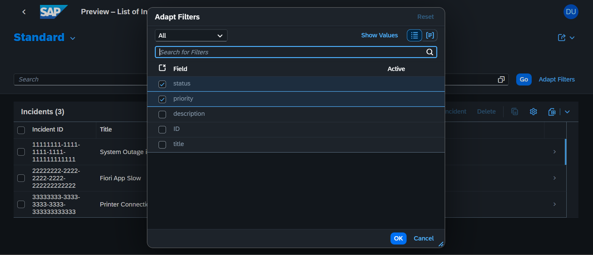

# 🛠️ SAP CAP Incident Management System

[](https://github.com/Banoth281/sap-incident-management/actions/workflows/ci.yml)

An enterprise-style incident management application built using the **SAP Cloud Application Programming Model (CAP)**, **Node.js**, **OData v4**, **SQLite**, and **SAP Fiori Elements**.

This project demonstrates CDS data modelling, OData service development, custom business logic, SAP Fiori Elements integration, database connectivity, and automated validation through GitHub Actions.

---

## 📖 Overview

The SAP CAP Incident Management System provides a structured application for creating, viewing, updating, and managing incident records.

The project demonstrates:

- Enterprise CDS data modelling
- OData v4 service development
- SAP Fiori Elements user interfaces
- Custom Node.js business logic
- SQLite database integration
- Automated CI validation with GitHub Actions

---

## 🚀 Features

- Incident creation and management
- Customer and priority management
- Incident status tracking
- SAP Fiori Elements List Report
- SAP Fiori Elements Object Page
- OData v4 API endpoints
- CDS entity modelling
- Custom validation and event handling
- SQLite-based local persistence
- Automated GitHub Actions workflow

---

## 🏗️ Architecture

```text
+-----------------------------+
|     SAP Fiori Elements      |
|   List Report / Object Page |
+--------------+--------------+
               |
               | OData v4
               |
+--------------v--------------+
|       SAP CAP Services      |
|       Node.js and CDS       |
+--------------+--------------+
               |
               | Business Logic
               |
+--------------v--------------+
|       SQLite Database       |
+-----------------------------+
```

---

## 🧰 Technology Stack

| Technology | Purpose |
|---|---|
| SAP CAP | Application and service framework |
| Node.js | Backend runtime |
| SAP CDS | Domain modelling and service definitions |
| OData v4 | API and data-service protocol |
| SQLite | Local development database |
| SAP Fiori Elements | Metadata-driven user interface |
| Express.js | Web application runtime |
| GitHub Actions | Continuous integration |

---

## 📁 Project Structure

```text
sap-incident-management/
├── .github/
│   └── workflows/
│       └── ci.yml
├── app/
│   └── incident/
├── db/
│   ├── data/
│   └── schema.cds
├── images/
│   ├── fiori-incident-list.png
│   ├── fiori-incident-list1.png
│   └── fiori-incident-list2.png
├── srv/
│   ├── cat-service.cds
│   ├── cat-service-ui.cds
│   └── cat-service.js
├── mta.yaml
├── package.json
├── package-lock.json
└── readme.md
```

---

## ⚙️ Installation

### 1. Clone the repository

```bash
git clone https://github.com/Banoth281/sap-incident-management.git
```

### 2. Open the project folder

```bash
cd sap-incident-management
```

### 3. Install the dependencies

```bash
npm install
```

### 4. Start the SAP CAP application

```bash
npx cds watch
```

The application will start at:

```text
http://localhost:4004
```

---

## 🌐 Endpoints and Testing

Once the application is running, use the following endpoints:

| Endpoint | Description |
|---|---|
| `http://localhost:4004` | SAP CAP service overview |
| `/odata/v4/incident` | Incident OData service |
| `/odata/v4/incident/$metadata` | OData metadata document |
| `/odata/v4/incident/Incidents` | Incident records |

Example:

```http
GET /odata/v4/incident/Incidents
```

---

## 🖥️ SAP Fiori Web Application

The user interface is generated using **SAP Fiori Elements** and CDS annotations.

### Incident List Report


### Incident Management View



### Incident Details


### UI Capabilities

- **Filter Bar:** Search and filter incidents by status, priority, and other fields.
- **List Report:** View incident IDs, titles, priorities, and statuses.
- **Object Page:** Open an incident to review its complete details.
- **Custom Actions:** Execute actions such as closing or deleting an incident.
- **Metadata-Driven UI:** Generate interface components from CDS annotations.

---

## ⚡ GitHub Actions

This repository uses GitHub Actions for continuous integration.

The CI workflow automatically:

- Checks out the repository
- Sets up Node.js
- Installs project dependencies
- Verifies the SAP CAP environment
- Validates CDS models
- Runs the configured project checks

The current workflow status is displayed at the top of this README.

---

## 📊 Database

The application uses SQLite for local development.

SAP CAP connects to the database and loads the configured seed data when the application starts.

The database model is defined in:

```text
db/schema.cds
```

Initial test data is stored in:

```text
db/data/
```

---

## 🎯 Skills Demonstrated

- SAP CAP application development
- Node.js backend development
- CDS domain modelling
- OData v4 service design
- SAP Fiori Elements development
- SQLite integration
- Event handlers and business validation
- Git and GitHub version control
- GitHub Actions CI
- Enterprise application architecture

---

## 👤 Author

**Santhosh Banoth**

- GitHub: [Banoth281](https://github.com/Banoth281)
- LinkedIn: [Santhosh Banoth](https://linkedin.com/in/banoth281)

---

## 📄 License

This project is licensed under the MIT License.
